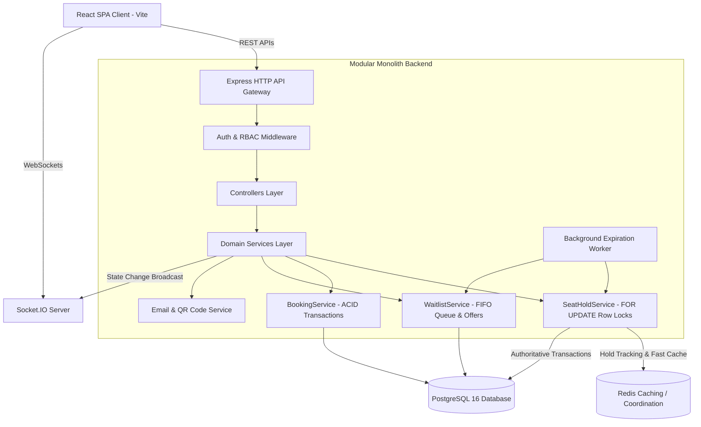

# System Architecture - Modular Monolith Ticket Booking Platform

## Architectural Overview

The Ticket Booking System is engineered as a high-performance modular monolith. All core capabilities—identity and authorization, venue management, seat inventory, ACID-compliant reservation locks, FIFO waitlist processing, QR ticket generation, and real-time Socket.IO synchronization—reside within a unified, highly maintainable Node.js codebase.

## Layered Responsibilities

### 1. Presentation & Routing Layer (Express & Socket.IO)
- `routes/`: Partitioned REST API definitions with middleware guards.
- `middleware/`: JWT verification, Role-Based Access Control (`CUSTOMER`, `ORGANISER`, `ADMIN`), and centralized error formatting.
- `controllers/`: HTTP payload extraction, status code mapping, and response serialization.

### 2. Business Domain Services
- `services/seatHoldService.js`: Transactional multi-seat holds with PostgreSQL row locks and Redis TTL coordination.
- `services/bookingService.js`: Atomically transfers held seats to confirmed bookings, generates QR codes, and orchestrates confirmation dispatches.
- `services/waitlistService.js`: Manages FIFO queues on sold-out categories and dispatches secure cryptographically random offer tokens upon booking cancellations.
- `services/emailService.js` & `services/qrService.js`: Produces base64 QR tickets and HTML confirmation templates with local console fallback.

### 3. Background Asynchronous Workers
- `jobs/expirationWorker.js`: Periodic scheduler ensuring expired holds and abandoned waitlist offers are reclaimed in PostgreSQL and broadcast to connected clients in real time.

### 4. Data Storage & Cache Layer
- **PostgreSQL**: The single authoritative source of truth for seat states, transactions, and relational data.
- **Redis**: Low-latency cache and TTL tracking coordinator across distributed instances.
